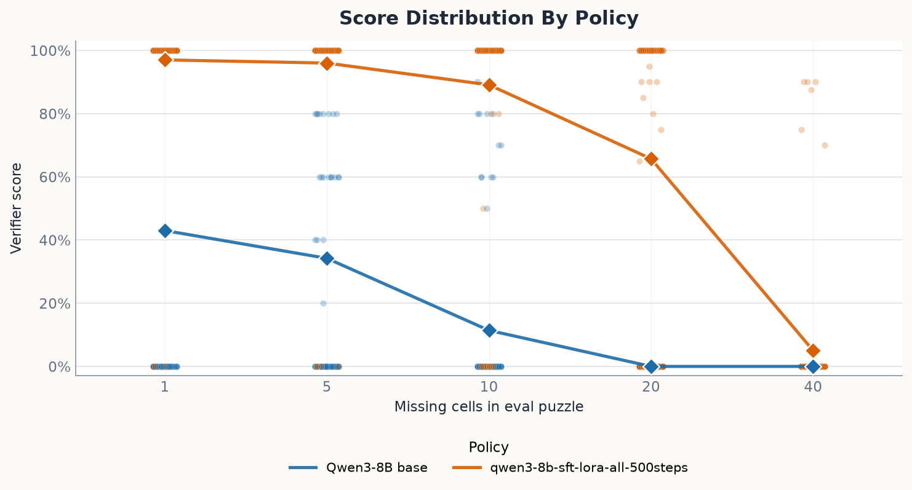

<h1 align="center">sudoku-rl</h1>

Small workbench to test out different RL and fine-tuning methods on a simple, easily verifiable problem. Also sudokus are fun.

Example:
```text
$ python scripts/eval_qwen.py --data data/eval/missing_1_100.jsonl --verbose

ATTEMPT 0:
+-------+-------+-------+
| 9 8 5 | 7 6 1 | 3 4 2 |
| 4 3 6 | 5 2 8 | 7 1 9 |
| 1 2 7 | 3 4 9 | 5 8 6 |
+-------+-------+-------+
| 8 5 7 | 6 1 4 | 2 3 9 |
| 3 1 9 | 2 8 7 | 6 5 4 |
| 6 4 2 | 5 3 9 | 1 7 8 |
+-------+-------+-------+
| 2 7 4 | 9 5 1 | 3 8 6 |
| 7 6 3 | 4 8 5 | 9 2 1 |
| 5 1 8 | 2 9 3 | 6 7 4 |
+-------+-------+-------+

SOLUTION 0:
+-------+-------+-------+
| 7 9 8 | 1 6 5 | 4 2 3 |
| 5 6 3 | 4 7 2 | 8 9 1 |
| 4 2 1 | 8 9 3 | 5 6 7 |
+-------+-------+-------+
| 8 5 7 | 6 1 4 | 2 3 9 |
| 3 1 9 | 2 8 7 | 6 5 4 |
| 6 4 2 | 5 3 9 | 1 7 8 |
+-------+-------+-------+
| 1 3 6 | 7 2 8 | 9 4 5 |
| 2 7 4 | 9 5 1 | 3 8 6 |
| 9 8 5 | 3 4 6 | 7 1 2 |
+-------+-------+-------+

SCORE: 0.0
=*=*=*=*=*=*=*=*=*=*=*=*=*=*=*=*=*=*=*=*=*=*=*=*=*=*=*=*=*=*=*=*=*=*=*=*=*=*=*=*=*=*=*=*=*=*=*=*=*=*

ATTEMPT 1:
+-------+-------+-------+
| 8 9 7 | 5 4 1 | 3 2 6 |
| 6 4 5 | 3 2 7 | 9 1 8 |
| 2 3 1 | 9 8 6 | 4 5 7 |
+-------+-------+-------+
| 7 1 4 | 8 9 2 | 5 6 3 |
| 5 2 8 | 6 1 3 | 7 4 9 |
| 9 6 3 | 4 7 5 | 2 8 1 |
+-------+-------+-------+
| 3 8 6 | 7 5 4 | 1 9 2 |
| 1 5 9 | 2 3 8 | 6 7 4 |
| 4 7 2 | 1 6 9 | 8 3 5 |
+-------+-------+-------+

SOLUTION 1:
+-------+-------+-------+
| 8 9 7 | 5 4 1 | 3 2 6 |
| 6 4 5 | 3 2 7 | 9 1 8 |
| 2 3 1 | 9 8 6 | 4 5 7 |
+-------+-------+-------+
| 7 1 4 | 8 9 2 | 5 6 3 |
| 5 2 8 | 6 1 3 | 7 4 9 |
| 9 6 3 | 4 7 5 | 2 8 1 |
+-------+-------+-------+
| 3 8 6 | 7 5 4 | 1 9 2 |
| 1 5 9 | 2 3 8 | 6 7 4 |
| 4 7 2 | 1 6 9 | 8 3 5 |
+-------+-------+-------+

SCORE: 1.0
=*=*=*=*=*=*=*=*=*=*=*=*=*=*=*=*=*=*=*=*=*=*=*=*=*=*=*=*=*=*=*=*=*=*=*=*=*=*=*=*=*=*=*=*=*=*=*=*=*=*
```

## Quickstart

Download one of the source datasets with the Kaggle CLI, then build the local splits. See `data/README.md` for the full data notes:

```bash
uv sync
mkdir -p data/radcliffe-3-million-sudoku-puzzles-with-ratings
uv run kaggle datasets download -d radcliffe/3-million-sudoku-puzzles-with-ratings -f sudoku-3m.csv -p data/radcliffe-3-million-sudoku-puzzles-with-ratings
unzip data/radcliffe-3-million-sudoku-puzzles-with-ratings/sudoku-3m.csv.zip -d data/radcliffe-3-million-sudoku-puzzles-with-ratings
uv run python -m data.split
uv run python -m data.mask
```

Then run an eval. See `scripts/README.md` for the other script commands:

```bash
uv sync --group gpu
uv run python scripts/eval_qwen.py --data data/eval/missing_1_100.jsonl --model Qwen/Qwen3-8B
```

## Data Format

```json
{"sudoku": "...", "solution": "..."}
```

`data/README.md` has the dataset notes and build commands.

## Tiny Scoreboard



The policies here are,

| policy | details |
| --- | --- |
| Qwen/Qwen3-8B Base | `thinking=False`, `max_new_tokens=256` |
| Qwen/Qwen3-8B SFT | `runs/qwen3-8b-sft-lora-all-500steps`, `thinking=False`, `max_new_tokens=256` |

[PLOT: Learning curve by training examples. x = training examples seen; y = held-out solve rate on a fixed eval set or fixed eval-suite average; line = method. Count one Sudoku puzzle prompt as one training example: SFT uses the gold solution directly, while GRPO/RFT/STaR may generate multiple attempts per example.]
