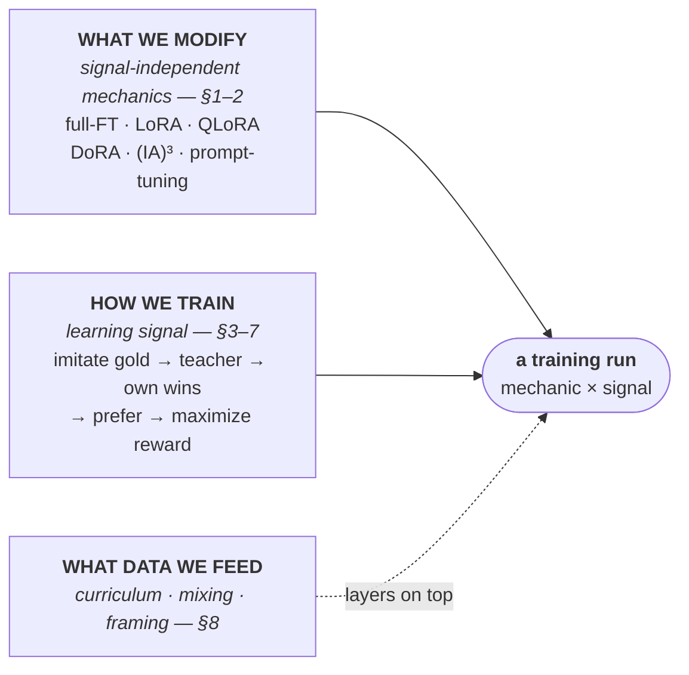
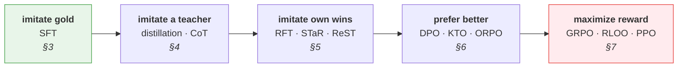

# Fine-Tuning Strategies

A menu of fine-tuning strategies for making a small LLM better at Sudoku, each with
*what it does*, *how it works*, and *how it fits this repo*. Use it to pick the next
experiment, not as a recipe to run top-to-bottom.

## Where we are today

- **Model:** `Qwen/Qwen3-8B`, thinking mode **off**.
- **Method:** SFT with LoRA (`r=16`, `alpha=32`, all-linear targets) via TRL `SFTTrainer`.
  Prompt = `format_prompt(grid)`, completion = the 81-char solution string.
- **The key asset:** `score_attempt` in `sudoku_rl/utils.py` is a cheap, exact, automatic
  reward. It returns the fraction of originally-blank cells filled correctly, and a hard
  `0.0` for any output that is not a valid 81-digit string or that overwrites a clue. This
  is a *verifiable reward*, so every preference and RL method below needs **no human labels
  and no learned reward model**.
- **Data:** Radcliffe 3M (carries a `difficulty` rating), Rohan Rao, Bryan Park. The split
  is keyed by the solved grid, so all copies of a solution land in the same split.

> **Verifier caveat (recurs everywhere below).** `score_attempt` compares each blank cell to
> *one stored solution*; `valid_solution` only checks length + charset. Neither checks
> Sudoku's row/column/box rules. So the reward is "matches the known answer per cell", not
> "is a legal grid". This is what makes partial credit hackable (see
> [Cross-cutting risks](#cross-cutting-risks)).

## How to read this: two axes, plus a data layer

A fine-tuning run is **two independent choices** — *what we modify* and *how we train* — plus
an optional layer of *what data we feed*. They compose: pick one from each.

| Axis | Question it answers | The choice is over… | Where |
|---|---|---|---|
| **What we modify** | Which parameters change, and how the loop runs? | full fine-tuning vs LoRA / QLoRA / DoRA / (IA)³ / prompt-tuning … | Part A · §1–2 |
| **How we train** | What learning signal do we optimize? | imitate gold → imitate teacher → imitate own wins → prefer better → maximize reward | Part B · §3–7 |
| **What data we feed** | Which examples, in what order/shape? | curriculum · mixing · augmentation · task framing | Part C · §8 |

The first two axes are **orthogonal**: `LoRA × SFT` (what you do now), `QLoRA × DPO`, and
`LoRA × GRPO` are all valid runs. *What we modify* trades off memory/capacity/cost and never
changes *what* the model learns; *how we train* is the actual learning signal; *what data we
feed* layers on top of any run.

The *how-we-train* axis (Part B) is a spectrum: each stage goes one step beyond imitating a
single fixed answer, and cost/power rise left to right.

You're currently at **`LoRA × SFT`** (§1 mechanic × §3 signal) on the Radcliffe-1000 split. A
concrete ordering for moving rightward is in
[Suggested progression](#suggested-progression-for-sudoku-rl).

---

## Part A — What we modify (signal-independent mechanics)

*Which parameters change, and how the training loop runs. None of this changes **what** the
model learns — only how many parameters, how cheaply, and how stably. Every mechanic here
combines with any learning signal in Part B.*

### 1. Parameter-efficient adaptation (PEFT spectrum)

Pick how much of Qwen3-8B to actually update, trading memory/capacity/cost. The repo uses
LoRA `r=16`. These adapters are signal-blind: the same LoRA config serves SFT, DPO, or GRPO.

| Method | What / how | Sudoku-rl fit | TRL/PEFT |
|---|---|---|---|
| **Full fine-tuning** | Update every weight. Maximum expressiveness, maximum memory (8B weights + Adam moments). | Overkill for a narrow task; only if LoRA plateaus on hard grids. | `peft_config=None` + FSDP |
| **GaLore** | Full-parameter FT, but project optimizer states to a low-rank subspace to cut memory. | The "train all weights cheaply" alternative to LoRA if its capacity caps accuracy. | `optim='galore_adamw'` |
| **LoRA** | Freeze `W`, learn low-rank `BA`: `h = Wx + (alpha/r)·BAx`. Mergeable at inference. | **Current method.** Right default; raise `r` if it underfits hard puzzles. | `LoraConfig` |
| **QLoRA** | LoRA on a 4-bit (NF4) frozen base, dequantized on the fly. | Fits Qwen3-8B comfortably on one ~16GB GPU; 4-bit error negligible for digits. | `BitsAndBytesConfig` + `LoraConfig` |
| **DoRA** | Split weight into magnitude + direction; LoRA only the direction. Beats LoRA at low `r`. | Near drop-in upgrade: `use_dora=True`. Cheap accuracy bump experiment. | `LoraConfig(use_dora=True)` |
| **rsLoRA** | Scale by `alpha/√r` instead of `alpha/r` so high ranks train stably. | Only matters if you push `r` to 64/128. | `LoraConfig(use_rslora=True)` |
| **LoRA+** | Higher learning rate for `B` than `A` to fix asymmetric init dynamics. | Free convergence tweak on the current run. | per-group LR optimizer |
| **AdaLoRA** | Allocate rank adaptively across layers by pruning small singular directions. | Better than flat `r=16` if some layers underfit; more knobs. | `AdaLoraConfig` |
| **VeRA** | Share one frozen random `A,B` everywhere; learn tiny per-layer scaling vectors. | Tiniest checkpoints; try if storing many adapters (one per difficulty). | `VeraConfig` |
| **PiSSA / LoftQ / OLoRA init** | SVD-derive the LoRA init from the weight (or quant error) instead of zeros/random. | Config-only; speeds convergence, recovers some LoRA↔full-FT gap. Pairs with QLoRA (LoftQ). | `init_lora_weights='pissa'|'loftq'` |
| **(IA)³** | Learn per-feature rescaling vectors for K, V, FF activations. | Far fewer params than LoRA; cheap baseline, may underfit the constraint structure. | `IA3Config` |
| **Prefix-tuning** | Prepend trainable K/V vectors at every attention layer. | Plausible but likely weaker than weight-space LoRA for actual solving. | `PrefixTuningConfig` |
| **Prompt-tuning** | Prepend a few trainable input embeddings; model fully frozen. | Lightest touch; almost certainly too weak to learn solving — use as a sanity probe. | `PromptTuningConfig` |
| **Adapter modules** | Insert bottleneck MLPs between frozen sublayers. | Like LoRA but **not mergeable**, so adds eval latency. LoRA preferred here. | adapters lib (custom) |
| **BitFit** | Train only bias terms. | Poor fit: Qwen3 uses RMSNorm and is largely bias-free, so few params to train. | custom (freeze non-bias) |
| **Adapter merging & stacking** | Fold `BA` into `W` (`merge_and_unload`), or combine/route several adapters. | Merge the SFT adapter for fast greedy eval and to seed RL; or train a per-difficulty adapter and route. | `merge_and_unload`, `add_weighted_adapter` |

### 2. Training-loop plumbing (signal-independent)

Machinery around the next-token loss, independent of which signal you optimize. It applies to
plain SFT (§3) and to the SFT inner-loop inside every other Part B method (the filtered-SFT in
§4–§5, the NLL terms in §6, the policy update in §7).

- **Completion-only loss masking** — Train only on the answer tokens. **How:** set the
  prompt's labels to the ignore index so gradients flow only from completion tokens.
  **Sudoku-rl:** **already on** — TRL defaults `completion_only_loss=True` for
  prompt/completion datasets, so the long, near-identical prompt isn't being learned. Don't
  silently disable it by collapsing the data into one `text` field.
- **Sequence packing** — Pack many short examples into one full-length sequence to kill
  padding waste. **How:** concatenate examples to `max_length`, separated by EOS, with a
  block-diagonal attention mask so examples can't attend across each other. **Sudoku-rl:**
  high value — each puzzle is ~160 tokens vs `max_length=512`, so batches are mostly padding.
  `SFTConfig(packing=True)` (needs FlashAttention varlen for correct masking).
- **NEFTune** *(noisy embedding fine-tuning)* — Near-free regularizer against overfitting.
  **How:** add scaled uniform noise to input embeddings during training only. **Sudoku-rl:**
  one flag (`SFTConfig(neftune_noise_alpha=...)`); cheap to ablate, but gains aren't
  guaranteed on such a rigid, low-entropy target.

---

## Part B — How we train (the learning signal)

*The actual learning signal. The sections run a spectrum — each goes one step beyond imitating
a single fixed answer: imitate the gold grid (§3) → imitate a richer teacher (§4) → imitate
your own verified wins (§5) → prefer better over worse (§6) → maximize a reward directly (§7).
Cost and power rise across the spectrum; reach rightward as cheaper signals plateau. Every
signal here combines with any mechanic from Part A.*

### 3. Imitate the gold answer — supervised fine-tuning (SFT)

The baseline signal and the foundation every later stage initializes from: copy the dataset's
gold solution token-by-token. The loss plumbing (masking, packing, regularization) lives in §2.

- **Plain SFT** *(behavior cloning)* — Reproduce the gold completion. **How:** minimize
  next-token cross-entropy `-Σ log p(x_t | x_<t)` over prompt+completion, with the prompt
  tokens masked out (§2). No reward, no sampling — just imitation. **Sudoku-rl:** the current
  method; the cheap baseline every preference/RL stage builds on. Its ceiling is the reason the
  rest of Part B exists: it only ever imitates **one** gold grid, so it can't learn from
  near-misses, its own mistakes, or a richer teacher.

### 4. Imitate a teacher — distillation & chain-of-thought SFT

Still imitation, but the target is **richer than the bare answer** — a stronger teacher's
outputs/logits, or explicit reasoning traces. The bet: a search problem is easier to learn when
the target shows *how* to fill cells, not just *what*. Two sub-axes: hard-label↔logit (how much
of the teacher you copy) and off-policy↔on-policy (whose text the teacher labels). Because the
dataset already ships solutions, distilling teacher *answers* is pointless — the value is in
distilling *traces*.

- **Sequence-level (hard-label) distillation** — SFT on a teacher's generated text. **How:**
  plain CE on `(x, teacher_output)`. **Sudoku-rl:** only useful as the offline-data step for
  distilling teacher *traces*; answer-only adds nothing over gold SFT.
- **Logit / KL distillation** *(Hinton)* — Match the teacher's full next-token distribution.
  **How:** `T²·KL(softmax(z_teacher/T) || softmax(z_student/T))`, optionally + CE. Needs a
  shared vocab (two Qwen3 sizes). **Sudoku-rl:** soft targets carry constraint info a one-hot
  hides, but a deterministic 81-char answer is near one-hot, so the gain is small unless you
  distill over a *trace*.
- **On-policy distillation (GKD)** — Push the teacher's distribution onto the **student's own
  samples** to fix train/inference mismatch. **How:** sample `y ~ student`, minimize a
  divergence (fwd/rev KL or JSD) on those tokens. **Sudoku-rl:** directly attacks greedy-decode
  drift mid-string; priciest distillation (online sampling + resident teacher) but usually
  strongest. `GKDTrainer`.
- **Reverse-KL / MiniLLM** — Mode-seeking distillation (`KL(student||teacher)`) so a small
  student commits to the teacher's high-prob modes instead of smearing mass. **Sudoku-rl:**
  desirable for a single-correct-answer target — commit to the one valid grid, don't hedge.
- **Long chain-of-thought distillation** — SFT on a reasoning teacher's full trace + answer,
  filtered to correct finals. **Sudoku-rl:** **the single most promising entry for hard
  grids** — have a reasoning teacher emit "r3c5 must be 7 because…" ending in the grid, keep
  `score==1.0` traces, SFT Qwen3-8B. Eval must extract the trailing 81 chars.
- **Distilling step-by-step** *(Hsieh et al.)* — Multitask: predict the label **and** generate
  a rationale, on shared params; drop the rationale at inference. **Sudoku-rl:** keep the
  bare-answer task (matches current eval exactly) and add a rationale task for regularization
  — reasoning's benefit with answer-only, fast inference.
- **Qwen3 thinking-mode SFT** — Train on completions with native `<think>…</think>` blocks,
  re-enabling the capability the repo disables. **How:** format as `<think>deduction</think>
  <81 chars>`, `enable_thinking=True`, keep the think span in the loss. **Sudoku-rl:** reuses
  Qwen3's pretrained reasoning prior; eval must strip `<think>` before scoring.
- **Synthetic constraint-propagation traces** — Skip the LLM teacher: a deterministic solver
  emits human-readable steps (naked/hidden singles, eliminations) as the trace. **Sudoku-rl:**
  cheapest source of high-quality reasoning, zero label noise, graded by Radcliffe difficulty.
  **Caveat:** singles/pointing don't crack hard puzzles (they need search) — serialize
  guess/backtrack steps or replay the gold solution for the remaining cells.
- **Step-by-step single-cell fill traces** — Completion fills one blank at a time, optionally
  restating the partial grid. **Sudoku-rl:** turns one 81-way joint prediction into many easy
  local ones and re-anchors against greedy drift; the natural action space if you later do
  step-level RL/PRM.
- **Process / step supervision (PRM data)** *(Let's Verify Step by Step)* — Value each
  reasoning *step*, not just the final answer. **Sudoku-rl:** step correctness is **exactly
  checkable** here (a cell-fill is good iff it matches the solution and violates no
  constraint) — so the labeler is free and exact, no PRM training noise. Feeds dense reward to
  later GRPO/PPO (§7). `PRMTrainer` lives only in `trl.experimental`.
- **Explanation-tuning (Orca-style)** — Distill richly-instructed teacher explanations on an
  easy→hard schedule. **Sudoku-rl:** long-CoT distillation + a deliberate Radcliffe-difficulty
  curriculum; largely overlaps with long-CoT, the curriculum is the distinguishing piece.
- **System-2 → System-1 distillation** — Reason long, verify, then SFT on **answer-only** so
  the reasoning compiles into one forward pass. **Sudoku-rl:** aligned with the repo's
  answer-only eval — keep accuracy gains of reasoning at train time, keep fast greedy decode
  at eval. Natural final step after a long-CoT/STaR phase.
- **Context distillation** — Bake a long heuristic/few-shot prompt into the weights so the
  model behaves as if it had the instructions without their token cost. **Sudoku-rl:** distill
  a verbose rules+heuristics prompt into the short no-thinking policy.

### 5. Imitate your own verified wins — self-bootstrapping

The first signal that uses `score_attempt`. Close a loop: **sample → keep the verified-good
ones → SFT on them → repeat.** No reward model, no critic, no preference pairs — the cheapest,
most stable way to turn the verifier into capability, and the natural step from imitating an
external target (§3–4) toward optimizing reward (§6–7). The methods differ in *what* is
filtered, *how* the threshold is set, and the *outer iteration* policy.

> **Sudoku gotcha for this whole section.** A completion is always a *full* 81-digit grid, so
> a sample scored `0.7` still contains concretely wrong digits. Training on it teaches wrong
> answers. So keep only `score == 1.0` grids; use partial credit and difficulty only to steer
> *how hard to sample*, never as a training-target weight.

- **Rejection-sampling fine-tuning (RFT)** *(≈ RAFT)* — Sample K per puzzle, drop the
  rejects, SFT on survivors. **How:** one EM step — the E-step samples & filters, the M-step
  is plain SFT. **Sudoku-rl:** sample K=8–64 at temp ~0.7–1.0, keep `score==1.0`,
  feed survivors to the existing `SFTTrainer`+LoRA. `score_attempt` doubles as a format
  filter. Sample more on hard Radcliffe puzzles; dedup identical correct grids.
- **STaR** *(self-taught reasoner)* — Keep reasoning traces whose **final answer** verifies,
  SFT on trace+answer. **Sudoku-rl:** the natural way to use Qwen3's (currently off) thinking
  mode — prompt for a scratchpad ending in the grid, keep traces at `score==1.0`. Needs
  nonzero initial success, so start on easy puzzles. Eval must parse the final 81 chars out
  of the trace.
- **STaR with rationalization** — For *failed* puzzles, show the model the answer and ask it
  to justify it; train on the backfilled rationale (hint stripped). **Sudoku-rl:** every row
  has a `solution`, so you can always rationalize hard grids that forward sampling never
  reaches. Guard against hollow post-hoc rationales by checking mid-trace placements.
- **ReST** *(grow → improve)* — One expensive "Grow" sampling pool, reused by several cheap
  "Improve" SFT passes at a rising reward threshold. **Sudoku-rl:** amortizes generation over
  many LoRA refits; gate the threshold schedule on *difficulty band*, not partial score.
- **ReST-EM** — Like ReST but each round re-initializes from the **fixed base model** (not the
  previous checkpoint), which curbs collapse. **Sudoku-rl:** the best-practices template here
  — binary `score==1.0` filter, fresh LoRA on base Qwen3-8B each round, ~2–4 rounds, watch
  eval for diminishing returns.
- **Expert Iteration (ExIt)** — An "expert" (search / many samples / self-consistency) makes
  high-quality solutions; an "apprentice" SFTs to imitate them; the stronger apprentice makes
  next round's search cheaper. **Sudoku-rl:** the expert can be self-consistency over thinking
  traces or light backtracking; over rounds the apprentice needs fewer samples to solve a
  given difficulty, letting you climb the curriculum.
- **Best-of-N distillation** — Distill best-of-N-under-the-verifier back into the model so a
  single **greedy** decode matches what N samples achieved. **Sudoku-rl:** directly targets
  the repo's greedy eval — sample N grids, keep the first `score==1.0`, SFT on it. Pick N per
  puzzle from Radcliffe difficulty.
- **Iterative SFT loop** *(umbrella)* — The scaffold under all of the above:
  `generate → filter → (append) → SFT → repeat`. **Sudoku-rl:** build this once; the named
  methods are just knob settings (binary vs partial filter, answer vs answer+trace, re-init
  vs continue, accumulate vs replace, temperature/N, curriculum). Reuse `format_prompt`,
  `score_attempt`, and the leakage-safe split.
- **Filtered chain-of-thought** — The shared primitive: keep a CoT trace only if its terminal
  answer verifies. **Sudoku-rl:** the concrete recipe to turn thinking-mode output into SFT
  data; optionally add a cheap secondary filter that mid-trace placements never violate
  row/col/box.
- **V-STaR** — STaR plus a *learned verifier* trained on the correct **and** discarded
  incorrect traces, used to rank candidates at test time. **Sudoku-rl:** mostly redundant —
  you already have a perfect *final-grid* checker. Only worth it to learn a *process/partial*
  verifier that prunes thinking traces before decoding all 81 cells.
- **Hindsight relabeling (HER-style)** — Turn wrong-but-legal outputs into free correct data:
  if a sample is a fully rule-valid grid `G` (just not *this* puzzle's answer), relabel it as
  the solution to a new puzzle (mask cells of `G`). **Sudoku-rl:** rewards exactly the
  property we want (globally consistent grids), even on "failures". **Requires adding a real
  Sudoku rule checker** (the current `valid_solution` won't do).

### 6. Prefer better over worse — offline preference optimization

The first signal that learns from *comparisons* rather than imitation. Collect (preferred,
rejected) pairs — or unpaired good/bad labels — and minimize a closed-form loss. No sampling at
train time, no critic, no learned reward model. The unifying trick (DPO) is the implicit reward
`r(x,y) = beta·log[π_θ(y|x)/π_ref(y|x)]`. Variants differ on: keep a reference model or drop
it, fold in an SFT term, length-normalize, need pairs or just labels.

> **Minting pairs for free.** Sample several grids per puzzle, score with `score_attempt`,
> and pair a clear winner (`score==1.0` or valid) against a clear loser (invalid/low). Avoid
> near-tie partial pairs (`0.91` vs `0.90`) — those are label noise.

> **TRL 1.7.0 reality.** `DPOTrainer` (with `loss_type` for IPO, cDPO, robust, sigmoid_norm,
> bco_pair) and `KTOTrainer` ship off the shelf. **SimPO, CPO, ORPO, BCO-standalone, Online-DPO
> are absent** — custom code or a pinned older TRL.

- **DPO** — Logistic loss on the implicit-reward margin against a frozen reference:
  `-log σ(beta·(Δlog-ratio_chosen − Δlog-ratio_rejected))`. **Sudoku-rl:** start from the SFT
  LoRA as `π_ref`; pair `score==1.0` vs invalid; balance pairs across difficulty. Reference
  log-probs cache, so each step is ~2 policy passes. `loss_type='sigmoid'`.
- **IPO** — Replace DPO's sigmoid with a squared-error target on the margin, so clean/always-
  preferred pairs can't push the margin to infinity and collapse the policy. **Sudoku-rl:**
  highly relevant — `score_attempt` gives very *clean* preferences (correct vs invalid is
  absolute), exactly DPO's over-optimization regime. `loss_type='ipo'`.
- **cDPO / Robust DPO** — Assume labels are noisy with prob `eps`; smooth the loss so the
  model never fully commits to any pair. **Sudoku-rl:** small `eps` protects borderline
  partial-credit pairs; for clean pairs keep `eps≈0` or filter them out.
- **SimPO** — Reference-free; implicit reward = **length-normalized** mean per-token log-prob,
  plus a target margin `gamma`. **Sudoku-rl:** lengths are fixed at 81, so the win here is the
  margin term and dropping the reference model (halves resident memory). Custom in TRL 1.7.0.
- **CPO** — Reference-free contrastive loss + an SFT (NLL) term on the chosen output.
  **Sudoku-rl:** the NLL term is extra SFT on valid solutions while the contrast pushes off
  bad grids, with no frozen copy in memory. Custom in TRL 1.7.0.
- **ORPO** — Single-stage, reference-free: `NLL(chosen) − lambda·log σ(log[odds(chosen)/odds(rejected)])`
  (odds use length-normalized sequence prob). **Sudoku-rl:** skip the separate SFT step — one
  pass goes base → aligned. The simplest "one trainer does it all". Custom in TRL 1.7.0.
- **KTO** — Aligns from **unpaired** binary good/bad labels via a prospect-theory utility
  around a reference point. **Sudoku-rl:** strong match — threshold `score_attempt` to tag
  every sampled grid desirable/undesirable; no per-puzzle pairing, and it tolerates the many
  invalid grids a small model emits early. `KTOTrainer`.
- **BCO** — KTO sibling: train the implicit reward as a binary classifier with a self-centering
  reward shift. **Sudoku-rl:** drop-in alt to KTO if its class-imbalance handling underperforms.
  Standalone trainer absent in TRL 1.7.0 (`loss_type='bco_pair'` gives a paired variant).
- **Iterative / Online DPO** — Regenerate fresh samples each round, relabel into new pairs,
  re-run DPO against the previous checkpoint. **Sudoku-rl:** `score_attempt` is the ideal
  in-loop labeler (no judge needed) — the strongest offline-flavored option and the most
  direct stepping stone to GRPO. Adding an NLL-on-chosen term (IRPO) reinforces valid grids.
- **Step-DPO** — DPO at the granularity of a single reasoning step / cell-fill: fix the
  correct prefix, prefer the correct next step over a wrong one. **Sudoku-rl:** natural with
  single-cell traces — the verifier auto-labels each cell-fill, targeting cascading errors.
- **DPOP (DPO-Positive)** — Add a penalty that stops the *chosen* response's likelihood from
  dropping (a known DPO failure mode). **Sudoku-rl:** correct grids are rare and edit-close to
  wrong ones, so vanilla DPO can suppress them — DPOP guards their probability mass.

### 7. Maximize a reward — online RL with verifiable rewards (RLVR)

The far end of the spectrum: the model generates grids, the verifier scores them, the policy is
nudged toward high-reward generations. Reach for it **after** SFT teaches the format, when you
want the model to *search* toward correct fills rather than imitate a fixed string. The
algorithms differ in how they estimate advantage (critic vs baseline vs group mean); reward
*design* matters as much as the optimizer.

> **TRL 1.7.0 reality.** `GRPOTrainer` and `RLOOTrainer` are first-class and take
> `reward_funcs=[score_attempt-wrapper]` directly. **`PPOTrainer` was removed** (use
> verl/OpenRLHF). For a single-/few-GPU LoRA setup, the **critic-free group methods
> (GRPO/RLOO/GSPO) are the practical default.**

#### Algorithms

- **RLVR paradigm** — The umbrella: `sample → r = verifier(y) → policy-gradient update`, with
  the programmatic verifier *replacing* the reward model. **Sudoku-rl:** this repo is an ideal
  target — plug `score_attempt` in as a reward function, start from the SFT checkpoint (not
  base), curriculum easy→hard so early reward is nonzero.
- **REINFORCE / vanilla policy gradient** — `loss = -(r − b)·Σ log π(token)`, baseline `b` =
  mean reward. **Sudoku-rl:** dense partial credit gives usable gradient even here; ~30 lines
  to hand-code; good for understanding before GRPO. High variance.
- **REINFORCE++** — Critic-free but keeps PPO's stabilizers (per-token KL, batch-normalized
  advantage, clipping); global batch baseline, not per-prompt. **Sudoku-rl:** steadier than
  GRPO when easy puzzles collapse the within-group std. Custom (no TRL trainer).
- **RLOO** — REINFORCE with a leave-one-out baseline: `A_i = r_i − mean_{j≠i} r_j` over K
  samples per prompt. **Sudoku-rl:** `RLOOTrainer`; sample K=4–8, baseline is automatic,
  sequence-level credit. Good simple default; add KL to preserve format.
- **PPO** — Actor-critic with a value head, GAE advantages, clipped surrogate. **Sudoku-rl:**
  best per-token credit but heaviest (3 resident nets even with the free verifier). The critic
  buys little over GRPO/RLOO on short 81-token completions — usually **not** the right first
  choice. Not in TRL 1.7.0.
- **GRPO** — Critic-free: per-prompt **group-relative** advantage
  `A_i = (r_i − mean(group))/(std(group)+eps)` (one scalar per sequence), + explicit KL. The
  DeepSeek-R1 method. **Sudoku-rl:** **the recommended default.** `GRPOTrainer`, G=8–16;
  partial credit gives rich within-group ranking. **Caveat:** easy grids → all samples ~1.0 →
  std≈0 → blown-up advantage; fix with curriculum, zero-variance-group filtering, or Dr. GRPO.
- **Dr. GRPO** — GRPO minus the divide-by-std and per-length normalization (they bias toward
  easy/hard prompts and long answers). **Sudoku-rl:** length fix is moot (fixed 81 chars) but
  the std fix directly helps when curriculum hits easy grids. `scale_rewards` off,
  `loss_type='dr_grpo'`.
- **GSPO** *(Qwen team)* — GRPO with importance ratio and clipping at the **sequence** level.
  **Sudoku-rl:** relevant since the policy *is* Qwen3, and the whole grid is naturally one
  "action". Try if token-level GRPO is unstable. `importance_sampling_level='sequence'`.
- **DAPO** — GRPO + clip-higher, **dynamic sampling** (drop all-correct/all-wrong groups),
  token-level loss, length shaping. **Sudoku-rl:** dynamic sampling is especially valuable —
  it concentrates compute on the frontier, synergizing with the difficulty curriculum.
  Partial in `GRPOTrainer`; dynamic sampling usually custom.

#### Reward design (what `r` should be)

- **Outcome reward (ORM)** — `r = 1` iff the whole grid is correct, else `0`. **Sudoku-rl:**
  `1.0 if score_attempt==1.0 else 0.0`; cleanest anti-hacking but brutally sparse on hard
  grids — use after curriculum/SFT lift the solve rate, or blend with dense.
- **Dense partial-credit reward** — Use the continuous `correct_blanks/total_blanks`.
  **Sudoku-rl:** the repo's native reward and the most sample-efficient bootstrap — but also
  exactly where hacking lives (it doesn't require global consistency). Anneal toward ORM.
- **Process reward (PRM)** — Score intermediate steps. **Sudoku-rl:** only if thinking mode is
  re-enabled; then the per-step reward can be **programmatic** (placement legal + forced),
  keeping it within RLVR. N/A for the current answer-only setup.
- **Format reward + clue-preservation penalty** — Graded structural terms instead of one 0/1
  cliff. **Sudoku-rl:** `score_attempt`'s hard `0.0` on bad format/clue-overwrite gives zero
  gradient to "almost-right" samples; add `+bonus` for a valid 81-char string and a soft
  penalty per overwritten clue, then **anneal to zero** so they can't be hacked. Multiple
  `reward_funcs` are summed.
- **Constraint-satisfaction (rule-based, solution-free) reward** — Reward how well the grid
  satisfies row/col/box rules, *without* comparing to a stored answer. **Sudoku-rl:** a
  genuinely different signal that fixes both the partial-credit hack and the single-solution
  bias. Best as a complement to dense cell-match. Needs a rule checker added.
- **KL-to-reference regularization** — Penalize drift from the frozen SFT model (the `beta`
  knob). **Sudoku-rl:** dense reward encourages mode collapse; KL keeps generations valid.
  With LoRA the "reference" is just the adapter at its SFT state — no second 8B in memory.
- **Entropy regularization** — Entropy bonus / floor to keep exploration alive. **Sudoku-rl:**
  a low-entropy 81-digit output under group methods can collapse to one rigid pattern and kill
  the gradient; an entropy floor keeps samples diverse enough for the verifier to discriminate.

#### Beyond single-turn

- **Multi-turn self-correction RL (SCoRe / RISE)** — Train the model to **revise** after
  feedback across turns, with reward shaped to credit improvement. **Sudoku-rl:** excellent fit
  — the verifier gives cheap precise feedback (which cells conflict), turning one-shot guessing
  into search-with-feedback (the project's stated theme). Needs a multi-turn harness; risk: the
  model learns to depend on feedback.

---

## Part C — What data we feed (layers on top of any run)

*Not a loss and not a weights mechanic: which examples, in what order and shape. Applies on
top of any Part A × Part B combination, and targets the two failure modes of the eval metric —
format/constraint violations on hard grids, and a wrong distribution of difficulty or shape.*

### 8. Curriculum, data strategy & task framing

- **Difficulty curriculum (Radcliffe ratings)** — Train easy→hard; only the row sampler
  changes. **Sudoku-rl:** Radcliffe is the only rated source; a 2-blank grid is near-free
  score, a 50-blank grid often goes invalid → 0. Easy-first gets reliable 81-char output, then
  ramp.
- **Blank-count / structural curriculum** — Order by `count('.')` (or solver propagation
  depth) instead of a label. **Sudoku-rl:** works for *all three* datasets; matches how
  `score_attempt` normalizes. Coarse — a logic-solver pass gives a better ordering.
- **Self-paced / automatic curriculum** — Let current accuracy pick the next difficulty
  (target the ~0.5–0.8 success band; prioritized level replay in RL). **Sudoku-rl:**
  `score_attempt` is a free competence signal — up-weight the band Qwen3-8B sits near 0.5,
  avoid wasting GRPO rollouts on saturated or impossible grids.
- **Hard-example mining (offline)** — Build the next train set from puzzles the policy gets
  wrong. **Sudoku-rl:** the exact verifier makes "wrong" free and unambiguous; surfaces the
  high-blank grids that hold the averaged metric down.
- **Online hard-mining** — In RL, bias batches toward puzzles with high reward variance (the
  ones that still carry a gradient). **Sudoku-rl:** partial credit gives graded rewards even on
  hard grids; filter/up-weight prompts with group std > 0.
- **Deduplication by solved grid** — Route every copy of a solution to one split. **Sudoku-rl:**
  **already done** in `data/split.py` (it dedups the *eval* side; the leakage guarantee comes
  from hash-routing, not dropping all repeats). Open improvements: dedup the train side too, and
  symmetry-aware dedup (a transposed/relabeled grid is the "same" puzzle but a different string).
- **Data mixing & source reweighting** — Choose how much of each source/difficulty to include.
  **Sudoku-rl:** Bryan Park skews easy, Rao is mostly one difficulty, Radcliffe spans the range
  — naive concatenation lets the easiest source dominate. Reweight toward Radcliffe's hard
  bands. `interleave_datasets(probabilities=...)`.
- **Sudoku-symmetry augmentation** — Generate valid pairs via the symmetry group (digit
  relabel, band/stack permute, transpose). **Sudoku-rl:** kills positional/digit-frequency
  overfitting (relabeling forces constraint use, not memorized positions). Combine with
  solution-keyed routing so copies don't leak across the split.
- **Procedural puzzle generation (back-generation)** — Start from full solutions, "dig" cells
  (optionally checking uniqueness with a solver). **Sudoku-rl:** unlimited data with a precise
  difficulty knob, removing dependence on the three datasets; feeds curriculum and RL
  exploration. Uniqueness checking matters or the cell-match reward is ambiguous.
- **Task reframing: single-cell / next-move prediction** — Predict one cell given the partial
  board, loop at inference. **Sudoku-rl:** stops greedy decode from compounding into an invalid
  string; lets you order forced moves first; per-cell training matches the per-cell metric.
  Cost: many forward passes per puzzle.
- **Masked-cell infilling** — Train to fill only the masked cells, at varying mask ratios.
  **Sudoku-rl:** the repo's `data/mask.py` already builds masked grids at fixed missing-counts
  — training on the same masking the eval uses is maximally on-distribution. (Autoregressive
  for a decoder model, not BERT-style.)
- **Tokenization & constrained decoding** — Check each cell maps to a stable token; constrain
  decoding to a well-formed output if not. **Sudoku-rl:** **verified** — Qwen3 tokenizes each
  digit separately, so an 81-digit *solution* is exactly 81 tokens; the "digits merge → wrong
  length" worry **does not apply** here. Residual value: constrain decode to exactly 81 digit
  tokens to kill rare length drift. Becomes real only if the base model is swapped.
- **Search distillation** — Distill a backtracking solver / MCTS / tree-of-thought rollouts
  into the policy (expert iteration / STaR realized as filtered SFT). **Sudoku-rl:** a
  backtracking solver is a perfect free teacher for any grid; most-constrained-cell-first
  ordering gives clean traces. The bridge from SFT to RL.
- **Scratchpad fine-tuning** — Train the model to write and rewrite an explicit board/candidate
  state before the final answer (optionally with a solver tool in the loop). **Sudoku-rl:**
  offloads the 81-cell bookkeeping a single forward pass struggles with, cutting clue-overwrites
  and invalid lengths. Pairs with single-cell prediction.
- **Self-play / iterated curriculum** — Generate puzzles at controlled difficulty, solve,
  verify, feed back; adapt difficulty to current competence. **Sudoku-rl:** generation is cheap
  and exact, so you can manufacture grids right at the model's frontier; combines self-paced
  curriculum + search distillation + STaR filtering into one loop.

---

## Cross-cutting risks

These bite mainly in the preference and RL stages (§6–§7) and are the reason reward/eval design
matters as much as the optimizer.

- **Partial-credit reward hacking.** `score_attempt` never checks row/col/box rules, so a
  policy can maximize expected reward with locally-plausible per-cell guesses that never form a
  legal grid. *Mitigate:* anneal dense → ORM; add a constraint-validity penalty; keep KL > 0;
  and **track full-solve rate, not just mean partial score** — partial score climbing while
  full-solve stays flat is the hacking signature.
- **Single-solution bias.** Comparing to one stored solution penalizes alternative valid
  solutions on non-unique puzzles. Minor for minimal-clue datasets; matters for heavily-blanked
  or generated grids → prefer uniqueness-checked generation or the rule-based reward.
- **Format / entropy collapse.** A rigid low-entropy 81-char target under group-relative RL can
  collapse to one deterministic pattern, zeroing the gradient. *Mitigate:* format reward,
  entropy floor, DAPO clip-higher/dynamic sampling.
- **Thinking-off assumption.** Length/overlong penalties and long-CoT budget tricks are moot
  while output is a fixed 81 chars — they matter only once thinking mode is re-enabled.

## Suggested progression for sudoku-rl

Cheap+safe → expensive+powerful. Each step is independently useful.

1. **Strengthen the SFT baseline** (§1–3) — completion-only masking (have) + NEFTune and
   PiSSA/LoftQ init as near-free quality bumps; keep LoRA; GaLore only if LoRA plateaus.
2. **Fix the verifier first** — add a true Sudoku rule checker, so constraint rewards, HER
   relabeling, and uniqueness-aware generation are all sound.
3. **Data leverage** (§8) — procedural mask-out generation + Radcliffe-difficulty curriculum +
   symmetry augmentation → a large, difficulty-graded corpus.
4. **Self-bootstrap with the verifier** (§5) — RFT / STaR / ReST-EM, plus HER relabeling of
   valid-but-wrong grids for free clean data.
5. **Offline preference stage** (§6, cheap, RL-free) — auto-build pairs from verifier scores;
   run DPO, then DPOP to protect correct-solution likelihood; Step-DPO if you move to step traces.
6. **Online RLVR last** (§7) — GRPO → add DAPO (dynamic sampling + clip-higher) + entropy
   control + a combined dense-cell + constraint reward → finally multi-turn self-correction
   (SCoRe/RISE) to realize the search-with-feedback theme.

## Deliberately excluded (to avoid padding)

RAFT ≡ RFT/best-of-N; SLiC-HF / RRHF are pre-DPO ranking losses subsumed by the DPO family;
SPPO / Nash-MD overlap with iterative DPO; VinePPO overlaps with PRM/dense reward; model
merging (TIES/DARE/soups) is only relevant if you train multiple difficulty specialists;
Spectrum generalizes BitFit. Mentioned, not expanded.
